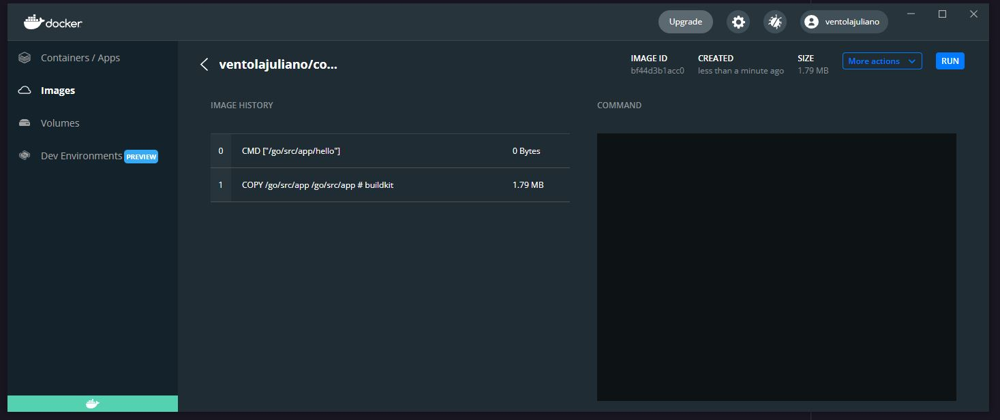

# Golang Docker Challenge - FullCycle

  

- The goal was create a simple go file to print a message using a docker image
- The docker image should not be bigger than 2MB
- The message needed to be "Code.education Rocks!"

# Docker Image

- You can find the image at:<br/>
  https://hub.docker.com/r/ventolajuliano/codeeducation

# How to use

- Clone the repository
- run in cmd:

  ```cmd
  docker build -t golang .
  ```

  ```cmd
  docker run --rm golang
  ```

  OR

- run in cmd:

  ```cmd
  docker build -t golang ventolajuliano/codeeducation
  ```

  ```cmd
  docker run --rm golang
  ```
